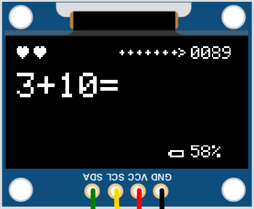

# Calculator_Toy
Device for kids which generates math equations to solve.

## Required SW
* [Arduino IDE](https://www.arduino.cc/en/main/software)
* Adafruit_GFX library
* Adafruit SSD1306 library
* Keypad library

## Hardware
The hardware consists of:
* Perfboard 7x9 cm
* [Arduino Nano](https://store.arduino.cc/collections/nano-family/products/arduino-nano)
* [0.96" SSD1306 OLED display](https://www.aliexpress.com/w/wholesale-ssd1306.html)
* Tactile push buttons 6x6x8mm
* [Push Button Switch 7x7x12mm](https://www.aliexpress.com/item/32826123110.html)
* Buzzer

  

 

The Display is supported with an additional pin-header on top, so the display is flush
to the housing.

To monitor the battery a voltage divider has been added from Vin to the analog input A0
with 47k and 10k resistors and a 1uF capacitor.

## Software
The software is compiled in Arduino IDE and uploaded to the Arduino Nano.
It was tricky to fit all the things into the memory of the Arduino Nano.

First the configuration screeen is shown to configure which operations are used in the
game and how big the numbers may be. For the operations it can be choosen from plus,
minus, multiplication and division. The number-space is defined by defining the maximum
small numbers. So the sum, the minuend, the dividend and product may be bigger.

Then the calculation game is started. There are three lives represented as hearts. If an
answer of the calculation is wrong, it costs a live. If the calculation is right, points
are earned. This depends on the time used to solve the calculation. Besides the score points
are shown which decrease the more time is needed. The remaining points are added to the
score if the right answer is given.

If the all lives were lost, the reached score is shown.

[Here is a life simulation of the circuit and code](https://wokwi.com/projects/378812103614159873)

## Housing / Enclosure
The housing is created with a sliding back to close the housing and support the PCB
for any button presses. The Buttons are designed with engraved numbers and symbols.

  

Added a lid to screw the housing shut and used filament change to add a second color for the inlets of the keys.

 

 

  

## Author
[Marco Graf](https://github.com/grafmar)
